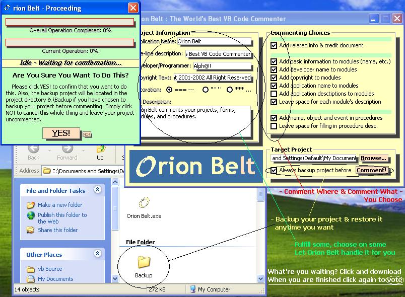

## Orion Belt 1\.2 \- VB Project Commenter \!\!\!

### Description

Orion Belt is an application that comments your Visual Basic projects. It has many features to make your works easier and your project nicer. With comments, people who see the code for the first time will have no hard time reading through your project. Commenting is one of the most essential parts in structure (Non-Spaghetti) programming, and it's extremely necessary for big projects. But why waste your valuable time thinking, designing and commenting your code? Try ORION BELT! Orion Belt comments your every VB projects, forms, modules, to the procedures! It automatically fills in some useful information as comments to make your project easier-to-understand. ***HEAVILY & NICELY COMMENTED***

P.S.: The screen shot contains the picture of Orion Belt 1.0, which is slightly different from this version (1.2). Download and try it yourself and if you found it useful please do not forget to VOTE!!!

[[[[[[[[[[[[[[[[[[[[[[[[[[[[[[[[[[[[VERSION 1.3 SUBMITTED: ALL KNOWN BUGS FROM THIS VERSION ELIMINATED!!! http://www.planet-source-code.com/vb/scripts/ShowCode.asp?txtCodeId=39451&lngWId=1]]]]]]]]]]]]]]]]]]]]]]]]]]]]]]]]]]]
 
### More Info
 

             |
---                |---
**Submitted On**   |2002-09-22 15:18:58
**By**             |[Alpha Binary](https://github.com/Planet-Source-Code/PSCIndex/blob/master/ByAuthor/alpha-binary.md)
**Level**          |Intermediate
**User Rating**    |4.9 (34 globes from 7 users)
**Compatibility**  |VB 3\.0, VB 4\.0 \(16\-bit\), VB 4\.0 \(32\-bit\), VB 5\.0, VB 6\.0
**Category**       |[VB function enhancement](https://github.com/Planet-Source-Code/PSCIndex/blob/master/ByCategory/vb-function-enhancement__1-25.md)
**World**          |[Visual Basic](https://github.com/Planet-Source-Code/PSCIndex/blob/master/ByWorld/visual-basic.md)
**Archive File**   |[Orion\_Belt1344179222002\.zip](https://github.com/Planet-Source-Code/alpha-binary-orion-belt-1-2-vb-project-commenter__1-39176/archive/master.zip)

### API Declarations

API-FREE!!!

